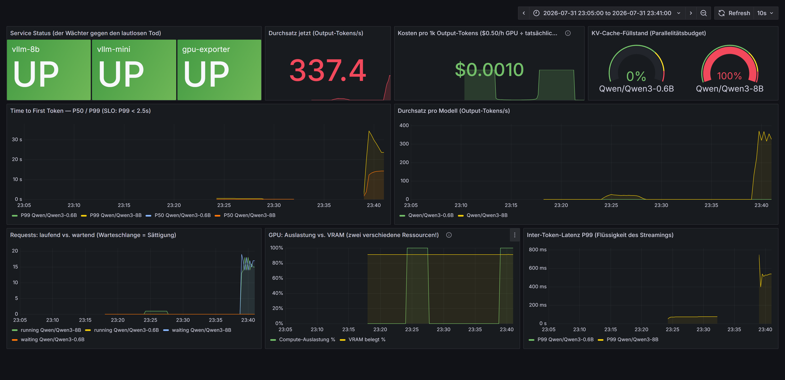
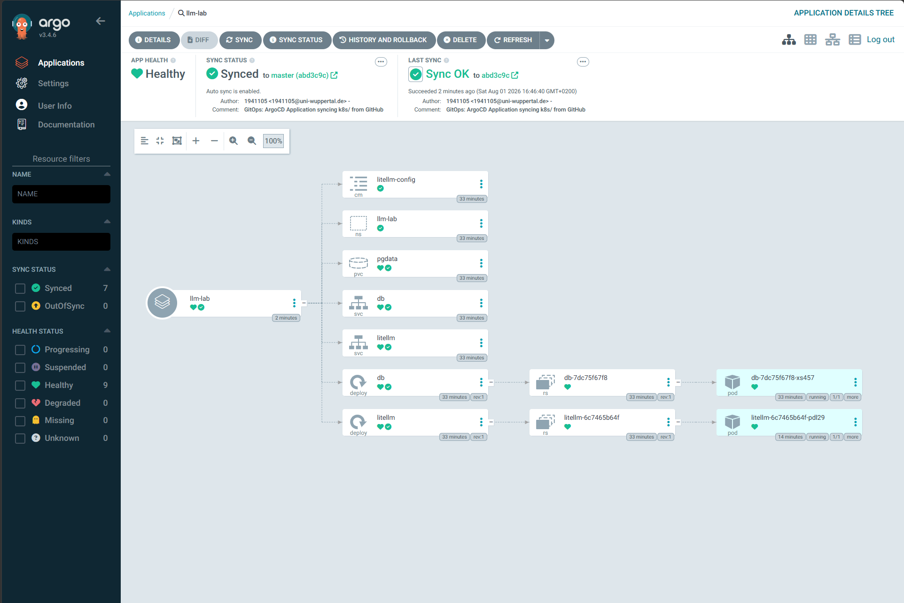

# LLM Inference Lab

A university-scale LLM serving platform in miniature — **built, measured, broken,
and repaired in 8 days** (Jul 27 – Aug 3, 2026) as deliberate preparation for
operating campus-wide LLM services: GPU model serving, an OpenAI-compatible
gateway with per-faculty governance, production-style monitoring with SLOs, and
a Kubernetes/GitOps deployment.

**Every number in this repo is measured, every operational failure is documented.**
Total cloud spend for the entire lab: **$7.07** ($3.91 GPU + $3.16 storage).

## Architecture

```
┌─ RunPod RTX 3090 (24 GB, EU-CZ-1) ─────────┐     ┌─ Local machine (Docker Desktop) ──────────┐
│  vLLM 0.26                                 │     │  docker compose:                          │
│   Qwen3-8B    :8000  primary               │     │   LiteLLM :4000 ── Postgres 16            │
│    (mem 0.76, ctx 8128)                    │◄────┤    virtual keys, budgets, rate limits,    │
│   Qwen3-0.6B  :8002  fallback, co-resident │     │    chargeback, fallback routing           │
│    (ctx 2048, seqs 4, enforce-eager)       │     │   Prometheus :9090 ── Grafana :3000       │
│  gpu_exporter.py :8888 (nvidia-smi)        │     │    SLO alert rules, dashboard as code     │
└────────────────────────────────────────────┘     │  k3d cluster: gateway as K8s manifests,   │
     ▲ HTTPS proxy (stable) / TCP SSH (volatile)   │  auto-synced from this repo by Argo CD    │
       network volume: venv + HF cache survive     └───────────────────────────────────────────┘
       pod stop/terminate
```

## Measured results

| Finding | Numbers |
|---|---|
| **Batching is almost free — until the knee** | c=1→8: 48→338 tok/s at ~153 ms median TTFT; the knee sits between c=8 and c=16 (TTFT median ×7 to 1.1 s); c=32: 772 tok/s but P99 TTFT 3.6 s |
| **Capacity per 24 GB GPU** | 125–200 concurrent students (duty-cycle model) at the SLO-compliant operating point c=8 |
| **Cost is a utilization property** | $0.27–0.41 per million output tokens when saturated — the same GPU serves tokens ~20× more expensively when idle-polled sequentially |
| **Governance works** | rpm-limited faculty key: requests 1–3 served, 4–6 rejected with 429; chargeback billed $0.0000844 for a 24-in/200-out request — arithmetic checks exactly |
| **Fallback chain, proven live** | one request, no client change: response `model` field walks `qwen-8b` → `Qwen/Qwen3-0.6B` (primary killed) → `qwen-8b` (recovered) |
| **The price of same-GPU co-residency** | fallback shrinks the primary's KV pool ~70% → at c=32: 772→334 tok/s, TTFT P99 18.1 s — while TPOT stays healthy at 73 ms (overload hits the *waiting*, not the *running*) |
| **Monitoring closes the loop** | `TTFTP99AboveSLO` alert fired during an induced c=32 overload; `ServiceDown` catches silent process death within 2 minutes |
| **Kubernetes pays out** | killed gateway pod replaced in **6 seconds**; scaling 1→2 replicas done by a single git commit — Argo CD synced it, no kubectl involved |

## Screenshots

| Grafana — live SLO dashboard | Argo CD — GitOps sync tree |
|---|---|
|  |  |

TTFT percentiles across the concurrency sweep:


## Repository layout

| Path | Contents |
|---|---|
| `serving/` | vLLM startup scripts (primary + capped fallback), benchmark harness, GPU exporter, raw results |
| `gateway/` | LiteLLM proxy config + Docker Compose stack (gateway, Postgres, Prometheus, Grafana) |
| `monitoring/` | Prometheus config (file service discovery), alert rules, provisioned Grafana dashboard |
| `k8s/` | Kubernetes manifests: namespace, deployments with probes, services, ConfigMap, Secret template |
| `argocd/` | The Argo CD Application bootstrapping GitOps sync of `k8s/` from this repo |
| `docs/` | Reports, models, runbook, SLOs, journal — see below |

## Documentation

- [Benchmark report](docs/benchmark-report.md) — the concurrency sweep, percentile analysis, saturation knee
- [Capacity model](docs/capacity-model.md) — students per GPU, cost per million tokens, duty-cycle math
- [Governance](docs/governance.md) — key layers, budgets, the two kinds of 429, fallback proof, co-residency rules
- [SLOs](docs/slo.md) — objectives derived from own measurements, with a deliberately induced breach as evidence
- [Runbook](docs/runbook.md) — incident procedures for `ServiceDown` and TTFT-SLO breaches, written for 3 a.m.
- [OpenShift bridge](docs/openshift-bruecke.md) — how every lab building block maps to OpenShift (AI) vocabulary
- [Journal](docs/journal.md) — the daily build/learn/fail log, including eight documented operational failures in a single day

*Some operational documents are written in German — the lab doubles as interview preparation for a German university context.*

## Run it yourself

**Serving** (any 24 GB CUDA GPU): `serving/start_vllm.sh` (primary) and
`serving/start_vllm_small.sh` (fallback) — start order matters on a shared GPU:
**small first, big second** (see [governance](docs/governance.md) §4).
Benchmark with `serving/benchmark/sweep.sh`.

**Gateway + monitoring** (local): copy `gateway/.env.example` → `.env` and
`monitoring/targets/pod-targets.json.example` → `pod-targets.json`, fill in your
endpoints, then `docker compose up -d` in `gateway/`. Committed files carry
structure; gitignored files carry secrets — the pattern repeats at every layer.

**Kubernetes + GitOps**: `k3d cluster create llm-lab`, copy
`k8s/litellm-secret.example.yaml` → `litellm-secret.yaml`, apply it, then
`kubectl apply -f argocd/application.yaml` — from that point on, `git push`
deploys.

## What broke (and what it taught)

The most instructive artifacts here are the failures: OOM ladders on a shared
GPU, silent SIGHUP process death, ports that change on every container start,
a benchmark that hit the memory wall instead of the compute wall, an alert that
fired exactly as designed. Day 5 alone produced eight documented failures with
eight derived rules — start at the [journal](docs/journal.md).

> Availability is not a feature but a discipline at every layer — process
> supervision, readiness, monitoring. Kubernetes turns that discipline into
> a platform property; this lab walks the manual path first to understand
> exactly what the platform takes over.
