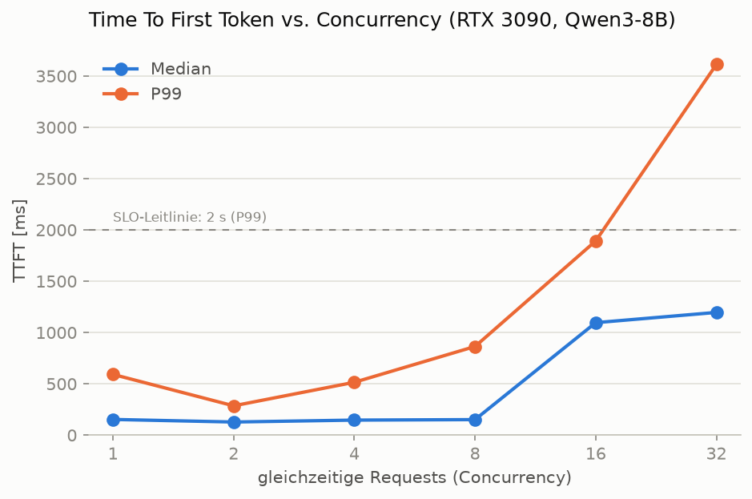
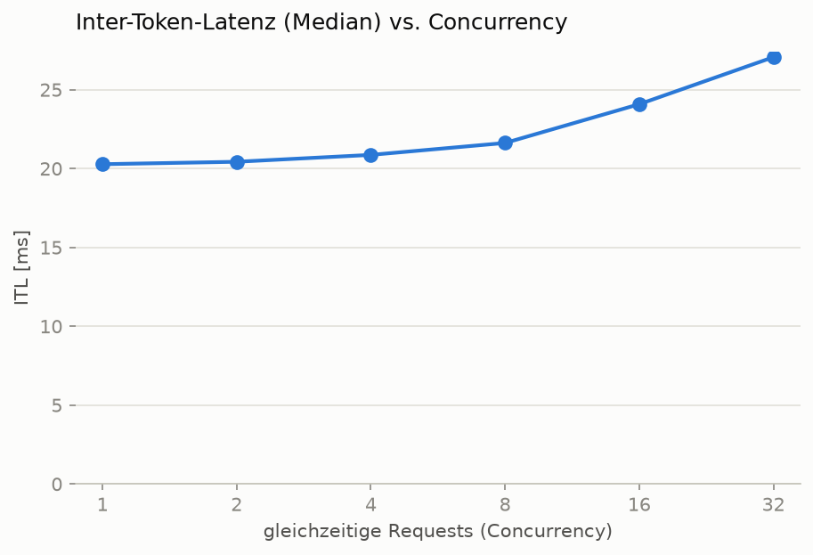
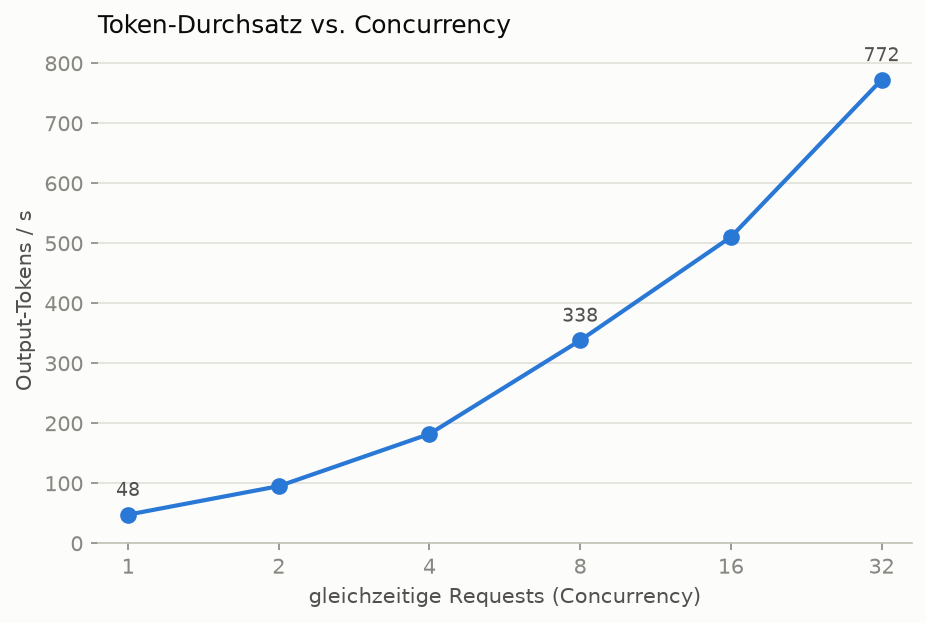
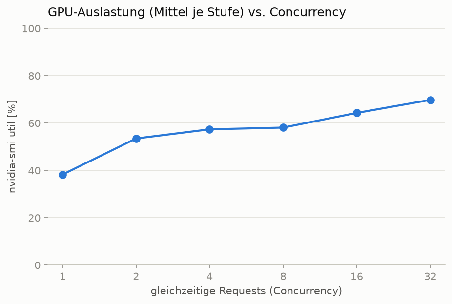

# Benchmark Report — Qwen3-8B on RTX 3090 (vLLM)

## Setup

| Component | Value |
|---|---|
| GPU | NVIDIA RTX 3090, 24 GB (RunPod Secure Cloud, EU-CZ-1, $0.50/h) |
| Model | Qwen/Qwen3-8B, BF16 (~16 GB weights) |
| Engine | vLLM 0.26.0, CUDA graphs enabled (no `--enforce-eager`) |
| Server flags | `--gpu-memory-utilization 0.95 --max-model-len 8128` |
| Workload | `vllm bench serve`, random dataset, 512 input / 256 output tokens, `num_prompts = 10 × concurrency` |
| Measurement | On-pod against `127.0.0.1` (no network noise); 1 Hz `nvidia-smi` sampling |

Raw data: [`serving/benchmark/results/`](../serving/benchmark/results/) · Harness: [`sweep.sh`](../serving/benchmark/sweep.sh) · Analysis: [`analyze.py`](../serving/benchmark/analyze.py)

## Results

| Concurrency | TTFT median | TTFT P99 | ITL median | Output tok/s | Req/s | GPU util (mean) |
|---|---|---|---|---|---|---|
| 1 | 153 ms | 592 ms | 20.3 ms | 48 | 0.19 | 38 % |
| 2 | 128 ms | 286 ms | 20.4 ms | 95 | 0.37 | 54 % |
| 4 | 146 ms | 515 ms | 20.9 ms | 182 | 0.71 | 57 % |
| 8 | 151 ms | 864 ms | 21.6 ms | 338 | 1.32 | 58 % |
| 16 | 1096 ms | 1892 ms | 24.1 ms | 510 | 1.99 | 64 % |
| 32 | 1196 ms | 3612 ms | 27.1 ms | 772 | 3.02 | 70 % |

All 630 requests across all stages completed without errors. Peak VRAM: 23.7 GB (the 0.95 pre-allocation, as expected).

## Findings

1. **Batching is nearly free up to c=8.** Throughput scales 7× (48 → 338 tok/s) while median TTFT stays at ~150 ms — continuous batching fills otherwise idle GPU cycles.
2. **The knee sits between c=8 and c=16.** Median TTFT jumps 7× (151 → 1096 ms): requests now queue for prefill/scheduling. Once admitted, streaming stays smooth — ITL only rises 20 → 24 ms. TTFT, not ITL, is the early-warning metric for overload.
3. **c=32 buys throughput with tail latency.** 772 tok/s, but P99 TTFT of 3.6 s — acceptable for batch jobs, not for interactive chat.
4. **GPU "utilization" never saturates (38–70 %).** LLM decoding is memory-bandwidth-bound; `nvidia-smi` utilization measures kernel-active time, not compute saturation. Headroom in this metric means room for *more concurrent requests*, not *faster single requests*.
5. **Averages hide the tail.** At c=1 the median TTFT is 153 ms but P99 is 592 ms — SLOs must be phrased over percentiles.

Operating recommendation and cost model: see [capacity-model.md](capacity-model.md).
